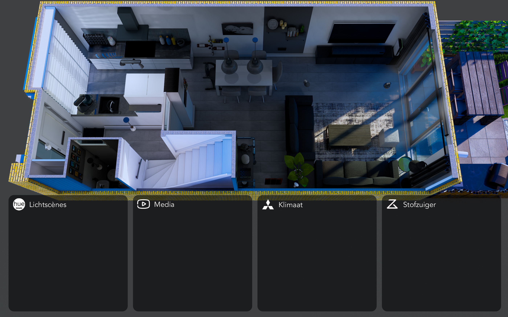
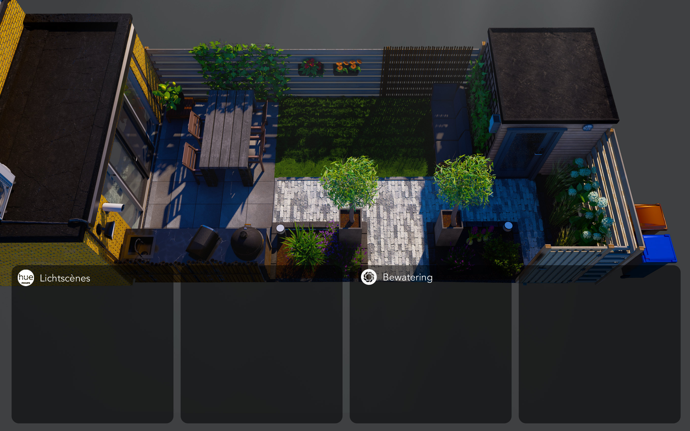
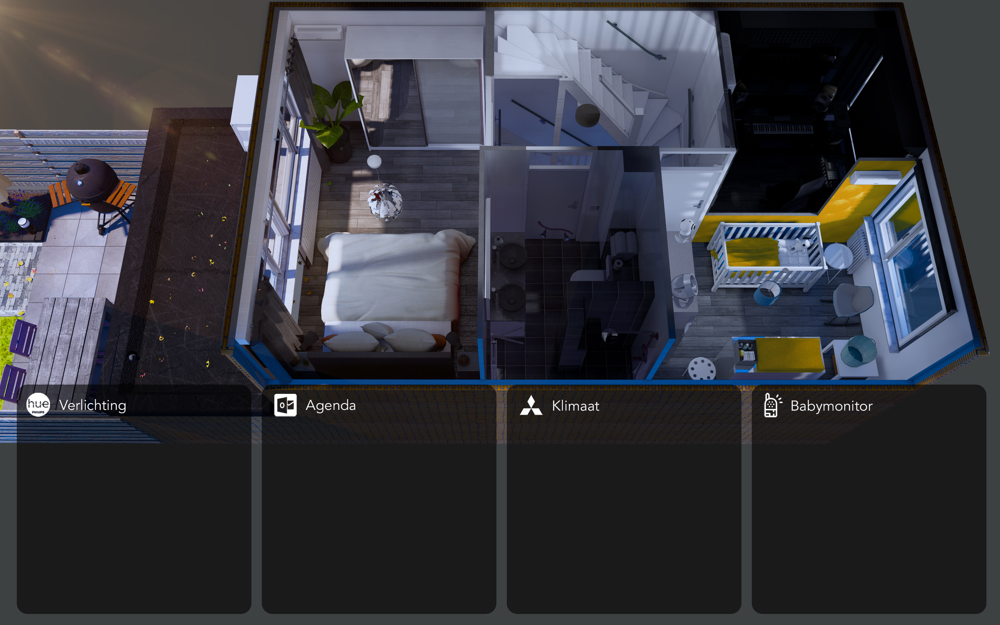

This is the configuration of my Smart Home dashboard in Home Assistant, which I have displayed on a wall-mounted tablet. For a demonstration, watch this video: https://www.youtube.com/watch?v=uKKh0s9z--c

Please be aware that some of the functionality shown in this video may differ from what is configured in the latest version of my repository

My goal is to inspire others to create their own 3D floorplans and delve into the possibilities of home automation. If any part of this configuration is unclear or requires further explanation, please do not hesitate to reach out. 

Please note that most of the stuff I did, I learned/copied from the floorplan config of Luke Vink.  you should checkout his repo first. It  has a good explaination on how the yaml code works in combination with config template card.
https://github.com/lukevink 

**Floorplan overviews**
The 3d design of the floorplan is created in Skecthup and rendered with Enscape. Then i edited them in Photoshop. The first idea was to create the cards with styling in the yaml file. However after endless fiddling with CSS, I realized that the cards are actually static within the design, allowing me to incorporate them directly into the background. As a result, all the cards simply float above the design.

**PSD Template**
Photoshop template for to easily generate image files. e.g. for colour synced lights: [Floorplan Template.psd ](https://github.com/re-1st/HA-3d-floorplan/blob/master/www/ui/floorplan/floorplan%20lights%20template.zip)

**Configuration**
- Home assistant (Yaml mode)

**Design**
- 3d design Build in Sketchup
- Rendered with Enscape
- Edited with photoshop
- (some of the) animated gifs are created in After Effects

**Hardware**
- Galaxy Tab s7+

**Disclaimer**:  I am  a hobbyist with no programming background.  I am certain that much of my YAML, CSS, JSON, etc., could be constructed better or more efficiently.  I welcome any suggestions that could improve my work. 
I've made this repository available to offer a comprehensive overview of my Smart Home configuration in Home Assistant. However much of the configuration relies on custom integrations, simply copying the entire code may not yield identical results. 

**Credits**
Heavily inspired by the awesome dashboard of Luke Vink: https://github.com/lukevink

A huge thank you to the wonderful Home Assistant community, always ready to support each other!

**Updates**
13-03-2024: I'm changing my light pop-ups with the custom 'more-info card'. Despite it is a custom card, It is standard HA functionality and it has way better responsiveness than all other cards I tested when using a toucscreen (tablet).